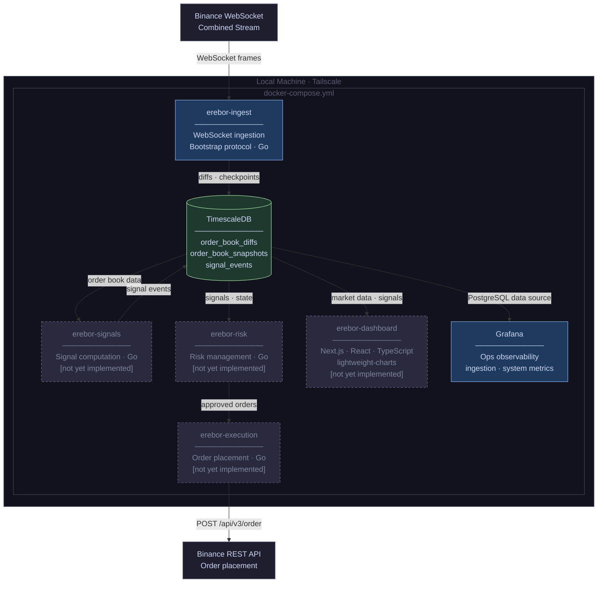

# erebor

[](https://github.com/edwinabot/erebor/actions/workflows/ci.yml)
[](https://codecov.io/gh/edwinabot/erebor)

Erebor is a personal algorithmic trading research platform. The backend is written in Go; the trading dashboard will be Next.js/React/TypeScript. It ingests Binance Level 2 order book data via a combined WebSocket stream, persists raw diff events and periodic book snapshots to TimescaleDB, and is designed to eventually support signal computation, risk management, and order execution. This is a learning and research project, not a production trading system.

## Architecture

Architectural decisions are recorded in [`adrs/`](adrs/):

- [ADR-001: Order Book Ingestion Service Architecture](adrs/ADR-001-order-book-ingestion/ADR-001-order-book-ingestion.md)
- [ADR-002: Infrastructure and Deployment Platform](adrs/ADR-002-infrastructure/ADR-002-infrastructure.md)
- [ADR-003: Dashboard](adrs/ADR-003-dashboard/ADR-003-dashboard.md)

## Implementation Status

| Module | Status | Notes |
|---|---|---|
| erebor-ingest | ✓ Implemented | See component breakdown below |
| erebor-signals | ○ Planned | |
| erebor-risk | ○ Planned | |
| erebor-execution | ○ Planned | |
| erebor-dashboard | ○ Planned | Next.js · React · TypeScript · lightweight-charts |
| Grafana (ops) | ○ Planned | TimescaleDB PostgreSQL data source |

**erebor-ingest components** (ADR-001 component model):

| Component | Status |
|---|---|
| StreamManager | ✓ Implemented |
| Dispatcher | ✓ Implemented |
| SymbolHandler | ✓ Implemented |
| OrderBook | ✓ Implemented |
| DepthFetcher | ✓ Implemented |
| Repository | ✓ Implemented |

The TimescaleDB schema (`order_book_diffs`, `order_book_snapshots`) is defined in [`migrations/001_initial_schema.sql`](migrations/001_initial_schema.sql). Docker Compose currently brings up TimescaleDB only; `erebor-ingest` runs outside Compose during development.

## Service Topology

Docker Compose is the current runtime. The topology below reflects all planned modules — unimplemented services are shown with dashed borders.



## Continuous Integration

CI runs on every push and pull request to `main` via GitHub Actions
([`.github/workflows/ci.yml`](.github/workflows/ci.yml)) and is split into three jobs:

- **format** — verifies `gofmt` cleanliness and that `go.mod` / `go.sum` are tidy.
- **lint** — runs `golangci-lint` (version pinned to match `.qlty/qlty.toml`).
- **test** — runs `go test -race -covermode=atomic -coverprofile=coverage.out ./...`,
  uploads `coverage.out` as a build artifact, and publishes the report to
  [Codecov](https://codecov.io/gh/edwinabot/erebor).

### Test coverage

Generate a coverage report locally with:

```sh
go test -race -covermode=atomic -coverprofile=coverage.out ./...
go tool cover -func=coverage.out      # textual summary
go tool cover -html=coverage.out      # browser report
```

To enable the Codecov badge, add a `CODECOV_TOKEN` repository secret in
GitHub. Public repositories may also use Codecov tokenless uploads.
