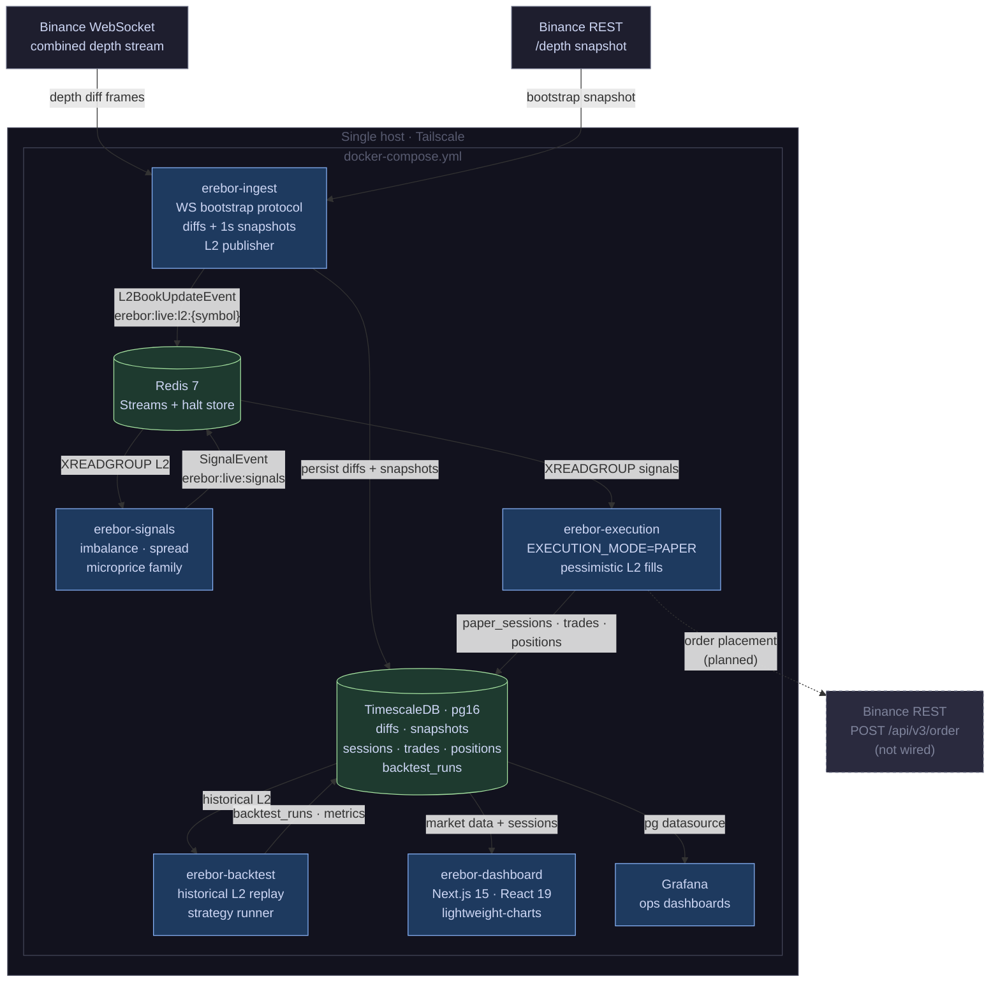
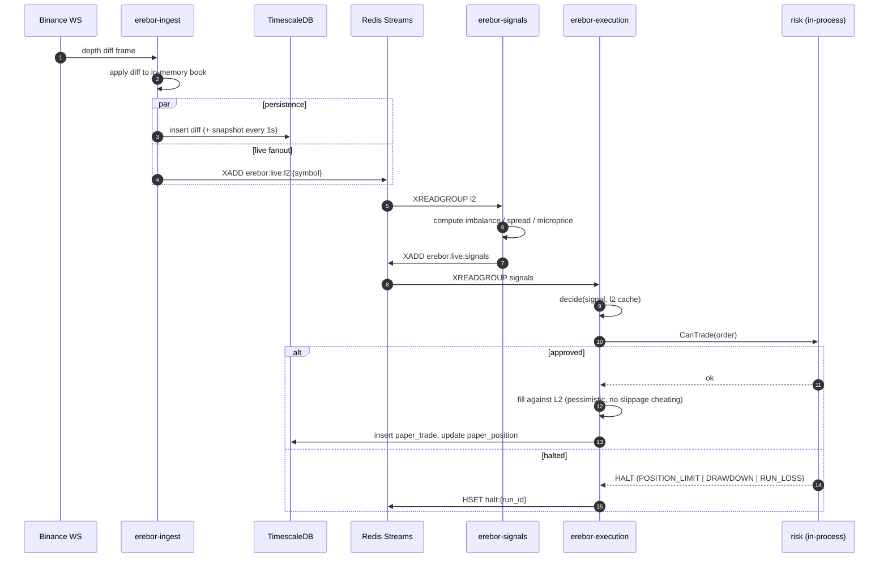
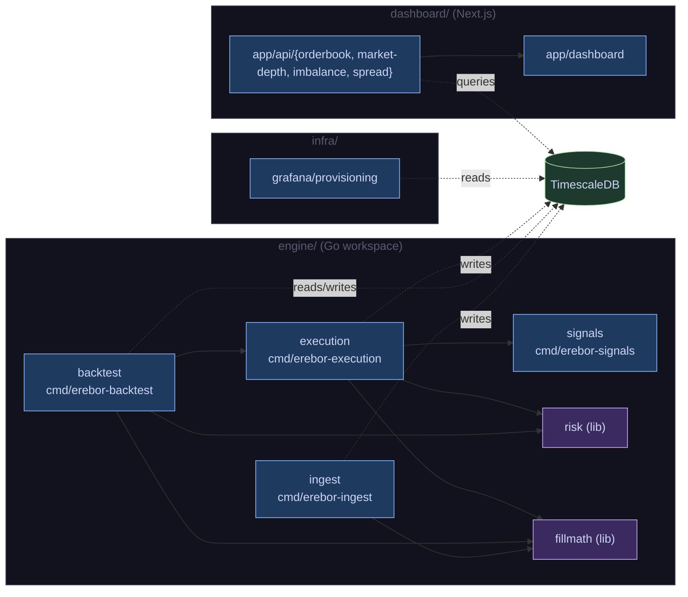
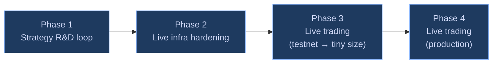

# erebor

[](https://github.com/edwinabot/erebor/actions/workflows/ci.yml)
[](https://codecov.io/gh/edwinabot/erebor)

Erebor is a personal algorithmic trading research platform targeting Binance spot markets. The backend is written in Go; the trader-facing dashboard is Next.js/React/TypeScript. It ingests Binance Level 2 order book data, persists raw diffs and periodic snapshots to TimescaleDB, computes signals over a live L2 stream, applies risk checks, and executes orders against a simulated venue (live paper trading) — all wired through Redis Streams. A separate backtest binary replays historical L2 from TimescaleDB at configurable speed to evaluate strategies against the same execution path.

This is a learning and research project, not a production trading system. Live Binance order placement is not yet wired up; see the [Roadmap](#roadmap-to-binance-live-trading--quant-research) for the path there.

## Contents

- [Architecture](#architecture)
- [Current State](#current-state)
- [Service Topology](#service-topology)
- [End-to-End Data Flow](#end-to-end-data-flow)
- [Module Map](#module-map)
- [Running Locally](#running-locally)
- [Continuous Integration](#continuous-integration)
- [Roadmap to Binance Live Trading & Quant Research](#roadmap-to-binance-live-trading--quant-research)

## Architecture

Architectural decisions are recorded in [`adrs/`](adrs/):

- [ADR-001: Order Book Ingestion Service Architecture](adrs/ADR-001-order-book-ingestion/ADR-001-order-book-ingestion.md)
- [ADR-002: Infrastructure and Deployment Platform](adrs/ADR-002-infrastructure/ADR-002-infrastructure.md)
- [ADR-003: Dashboard](adrs/ADR-003-dashboard/ADR-003-dashboard.md)

Per-feature specifications live in [`specs/`](specs/):

- [`specs/erebor-signals`](specs/erebor-signals/erebor-signals-spec.md)
- [`specs/erebor-risk`](specs/erebor-risk/erebor-risk-spec.md)
- [`specs/backtest-replay`](specs/backtest-replay/backtest-replay-spec.md)
- [`specs/paper-trading`](specs/paper-trading/paper-trading-spec.md)
- [`specs/trader-dashboard`](specs/trader-dashboard/trader-dashboard-spec.md)

## Current State

| Module | Path | Status | Notes |
|---|---|---|---|
| `erebor-ingest` | [`engine/`](engine/) | ✓ Implemented | Binance combined WS stream, bootstrap protocol, raw diffs + 1s snapshots to Timescale, L2 publisher to Redis |
| `erebor-signals` | [`engine/signals/`](engine/signals/) | ✓ Implemented | Consumes L2 from Redis, computes imbalance/spread/microprice family, publishes to signals stream |
| `erebor-risk` | [`engine/risk/`](engine/risk/) | ✓ Implemented | Shared library: pre-trade checks (position, drawdown, run-loss), Redis-backed halt store |
| `erebor-execution` | [`engine/execution/`](engine/execution/) | ✓ Paper mode only | `EXECUTION_MODE=PAPER`; pessimistic L2 fill, durable positions and trades in Timescale |
| `erebor-backtest` | [`engine/backtest/`](engine/backtest/) | ✓ Implemented | Historical L2 replay from Timescale with speed control, shares the execution + fillmath + risk packages |
| `fillmath` | [`engine/fillmath/`](engine/fillmath/) | ✓ Implemented | Single source of truth for fill arithmetic used by paper + backtest executors |
| `erebor-dashboard` | [`dashboard/`](dashboard/) | ✓ MVP | Next.js 15, lightweight-charts; order book ladder, market depth, imbalance, spread |
| Grafana (ops) | [`infra/grafana/`](infra/grafana/) | ✓ Provisioned | TimescaleDB datasource, ingest/health dashboard |
| Live Binance order placement | — | ○ Not started | See roadmap |
| Quant research workflow | — | ○ Backtest CLI only | No parameter sweeps, walk-forward, or stat tooling yet |

**Schemas** (each module owns its migrations, loaded by Timescale on first boot via `docker-entrypoint-initdb.d`):

- [`engine/migrations/001_initial_schema.sql`](engine/migrations/001_initial_schema.sql) — `order_book_diffs`, `order_book_snapshots`
- [`engine/backtest/migrations/002_backtest_schema.sql`](engine/backtest/migrations/002_backtest_schema.sql) — `backtest_runs`, derived metrics
- [`engine/execution/migrations/003_paper_trading_schema.sql`](engine/execution/migrations/003_paper_trading_schema.sql) — `paper_sessions`, `paper_trades`, `paper_positions`

## Service Topology

Docker Compose is the current runtime. Every service runs on a single host on the Tailscale-internal `erebor_net` bridge network. Bracketed services have not been wired yet.



## End-to-End Data Flow

The same execution path serves live paper trading and historical backtests. The only thing that differs is where L2 events originate and the namespace used on Redis (`erebor:live` vs `erebor:backtest:{run_id}`).



For backtests, the producer of `l2:{symbol}` events is `erebor-backtest`'s replay loop, which reads `order_book_snapshots` + `order_book_diffs` from Timescale at the requested wall-clock speed instead of WebSocket frames. Everything downstream is identical.

## Module Map



The Go workspace ([`go.work`](go.work)) stitches together six modules:
`engine` (ingest), `engine/signals`, `engine/execution`, `engine/backtest`, `engine/risk`, `engine/fillmath`.
Each has its own `go.mod` so it can be built and tested independently — and so a deploy target can ship the minimal binary it needs without dragging the whole tree.

## Running Locally

Bring up the data plane (TimescaleDB + Redis), then run any binary against it.

```sh
# infrastructure only — apply migrations on first boot
make db-up

# build + run ingest against a local config
make build
./bin/erebor-ingest --config engine/config.example.yaml

# full stack (ingest, signals, execution paper, dashboard, grafana)
docker compose up -d

# per-module test targets
make test-ingest
make test-signals
make test-execution
make test-risk
make test-backtest
make test-fillmath
make test            # all of the above
```

Required environment variables for paper trading: `BINANCE_API_KEY`, `BINANCE_API_SECRET` (used for the public REST snapshot only — no signed order endpoints are touched yet), `TIMESCALEDB_PASSWORD`, `REDIS_PASSWORD`. See [`docker-compose.yml`](docker-compose.yml) for defaults.

## Continuous Integration

CI runs on every push and pull request to `main` via GitHub Actions
([`.github/workflows/ci.yml`](.github/workflows/ci.yml)) and is split into three jobs:

- **format** — verifies `gofmt` cleanliness and that every module's `go.mod` / `go.sum` are tidy.
- **lint** — runs `golangci-lint` (version pinned to match `.qlty/qlty.toml`).
- **test** — runs `go test -race -covermode=atomic -coverprofile=coverage.out ./...` for the workspace, uploads `coverage.out` as a build artifact, and publishes the report to [Codecov](https://codecov.io/gh/edwinabot/erebor).

### Test coverage

```sh
go test -race -covermode=atomic -coverprofile=coverage.out ./...
go tool cover -func=coverage.out      # textual summary
go tool cover -html=coverage.out      # browser report
```

---

## Roadmap to Binance Live Trading & Quant Research

This roadmap is tentative and reflects the current best understanding of what is missing between today's paper-trading platform and (a) a system that can place real Binance spot orders responsibly, and (b) a workflow suitable for quantitative strategy research. Items inside a phase are roughly ordered; phases are gated by the items above them.



### Phase 1 — Strategy research loop (no real money)

Before live order placement is safe, the research workflow needs to be tight enough to *find* something worth trading and to *measure* it honestly. Today the backtest binary runs one configuration at a time and emits per-run metrics; that's the starting point, not the finish line.

- **Strategy interface stabilization.** Lift the current ad-hoc strategy from `engine/backtest/execution` into a `Strategy` interface (`OnSignal`, `OnBookUpdate`, `OnFill`) shared by backtest and live paper executors. One strategy implementation must run unchanged in both contexts.
- **Parameter sweeps.** A `backtest sweep` subcommand that takes a parameter grid (YAML or CLI) and fans out N runs to a worker pool, writing each result row to `backtest_runs`. Output: a comparison table (Sharpe, MaxDD, hit rate, turnover, fees-as-pct-of-pnl).
- **Walk-forward validation.** Repeated train/test splits across the historical window to surface in-sample overfitting. Required before any strategy graduates to paper trading on live data.
- **Statistical sanity layer.** Bootstrap confidence intervals on Sharpe and on per-trade P&L; a deflated Sharpe ratio computation that accounts for the number of trials in the sweep. Implemented in Go (no Python — see [project memory](#) on the stack constraint).
- **Equity-curve and trade-blotter views in the dashboard.** New `/research/runs` page lists `backtest_runs` and `paper_sessions` side by side; click-through to an equity curve, drawdown plot, and trade list backed by `paper_trades` / backtest equivalents.
- **Cost realism.** Audit the pessimistic fill model against Binance's actual fee tiers (maker/taker, BNB discount) and add explicit modelling for partial fills and queue-position assumptions. Document fill-model assumptions next to `fillmath`.
- **Data quality gates.** Detector job that flags ingest gaps, snapshot-vs-replay divergence, and out-of-order diffs over a rolling window. Backtests that span a flagged window get a warning in the result row.

**Exit criteria for Phase 1:** at least one strategy with a defensible out-of-sample Sharpe and a paper-trading session that has run for ≥30 days without a fill-model regression vs. its backtest.

### Phase 2 — Live infrastructure hardening

The current stack runs on one host with Docker Compose and a single Redis. That's fine for research; it is not fine for a process that can move real money.

- **Secrets management.** Move API keys out of `.env` files into a real secret store (sops + age, or a hosted equivalent that fits the $500/yr [budget](#)). Rotate the existing keys after the move.
- **Backups.** Scheduled `pg_dump` of TimescaleDB to off-host storage, with a tested restore runbook. Today losing the host loses every trade record.
- **Observability beyond Grafana.** Per-component health endpoint already exists (`:8080/healthz` on ingest); extend to signals/execution. Add a Prometheus exporter on each binary and a Grafana alert rule for: ingest gaps > N seconds, halt-flag set, execution consumer lag, divergence between Redis-stream length and expected throughput.
- **Idempotent restart story.** Every binary already uses Redis consumer groups; document and test the cold-start path (what state does each service recover from? where is the snapshot of last-acked offset stored?).
- **Schema migration discipline.** Today migrations are auto-applied by Timescale's init script on first boot. Replace with an explicit migration tool (`tern` or `goose`) so upgrades on a live database don't depend on a fresh volume.
- **Single-host failure modes documented.** Explicit decision recorded as an ADR: this is a single-host system by [budget choice](#); the failure mode for host loss is "stop trading and restore from backup," not failover.

### Phase 3 — Live trading on testnet, then tiny size

This is the phase where the diff matters. The `EXECUTION_MODE=PAPER` switch in `erebor-execution` is the seam — `MODE=LIVE` becomes a real binary.

- **Binance REST client.** Signed-request helper (HMAC-SHA256), rate-limit-aware (`X-MBX-USED-WEIGHT-1M`), with retries and a kill switch that opens at the first 4xx that indicates a credential problem.
- **Order lifecycle tracking.** A new `live_orders` table with state machine: `pending → submitted → ack'd → (partial filled | filled | canceled | rejected)`. Every transition is journaled before the REST call, so a crash after sending but before persisting can be reconciled on restart by querying Binance.
- **Reconciliation loop.** A dedicated goroutine that periodically diffs Binance-reported balances/open-orders against local state and halts the executor on any mismatch.
- **Live `Executor` implementation.** Mirrors the paper executor's signal-consumer + decider flow, but the "fill" step posts to Binance and waits for a USER_DATA_STREAM execution report. Fill arithmetic still comes from `fillmath` so reported PnL stays comparable with backtests.
- **Real risk limits.** Per-symbol notional cap, per-session loss cap, max orders/min, max position. All enforced *before* the REST call and re-checked on every fill from user-data stream. The existing `risk.Checker` and Redis-backed halt store are the substrate.
- **Kill switch.** Single command (and one Grafana button) that flips a Redis flag the executor checks before every order submission. Documented to be the first response to anything anomalous.
- **Testnet bake.** Run the full live path against [Binance Spot Testnet](https://testnet.binance.vision) for ≥2 weeks with realistic order sizing. Compare reported fills to what the paper executor would have produced on the same signals.
- **Production cutover at minimum viable size.** Smallest possible order size (e.g. $10 notional) for the first month on production endpoints. Daily reconciliation review before increasing size.

### Phase 4 — Scaling and ongoing operation

- **Strategy portfolio.** Run more than one strategy concurrently against separate notional budgets; per-strategy attribution in the dashboard.
- **Capital allocation.** Periodic rebalancing of notional between strategies driven by recent risk-adjusted performance (with explicit guardrails against chasing recent winners).
- **Post-trade analytics.** Slippage vs. modeled fills, fee leakage, per-symbol PnL decomposition. Feeds back into Phase 1 cost-realism work.
- **Disaster-recovery drill cadence.** Quarterly test of the backup-restore path against a scratch database.

### Out-of-scope (for now)

These are deliberate exclusions, not oversights:

- **Multi-exchange support.** Binance only. Adding a venue means redesigning the L2 publisher, the order schema, and the risk model.
- **Derivatives / margin / leverage.** Spot only. The fill model, the risk checker, and the position store all assume long-only spot positions.
- **HFT-grade latency.** The stack runs over WebSocket on a residential host; sub-50ms strategies are out of scope by infrastructure choice.
- **A Python or JVM research stack.** All Go, by [stack decision](#); research tooling is built in Go or as Next.js views over the database.
