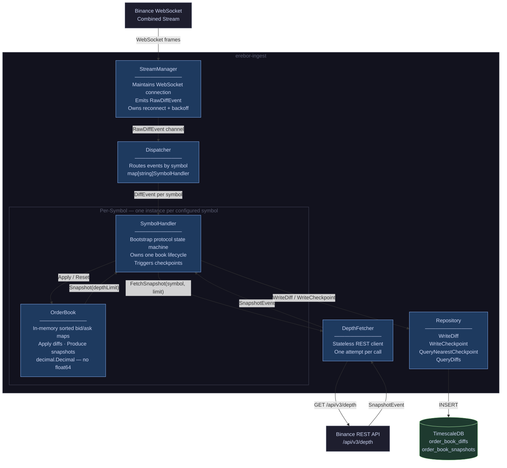
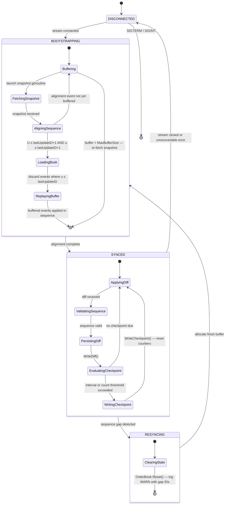

# ADR-001: Order Book Ingestion Service Architecture

**Status:** Draft
**Date:** 2025-05
**Component:** `erebor-ingest`
**Author:** Erebor Architecture Session

---

## Context

Erebor requires a continuous, sequentially-consistent feed of Binance Level 2 order book data. This data serves two consumers: real-time signal computation (future scope) and historical backtesting replay. The ingestion service must be the authoritative source of this data — correctness is non-negotiable, because a corrupted order book silently poisons every downstream signal.

Binance exposes order book data through two mechanisms that must be used in concert: a REST depth snapshot endpoint and a WebSocket diff stream. Neither alone is sufficient. The snapshot gives a consistent starting state; the diff stream provides continuous updates. The protocol for combining them is non-trivial and specified precisely by Binance.

This ADR records the architectural decisions made for the ingestion service and the rationale behind each.

---

## Decision 1: Hybrid Persistence — Raw Diffs and Periodic Checkpoints

### Options Considered

**Option A — Raw diffs only.**
Persist every delta event as received. Minimal write complexity. Backtesting must replay the full event log from the beginning of recorded history to reconstruct book state at any timestamp. O(n) seek cost. The backtesting engine must contain a full order book reconstruction engine.

**Option B — Reconstructed snapshots at fixed intervals.**
Maintain a live in-memory book, apply diffs, serialize full book state to storage every N milliseconds. O(1) backtest seek. Storage cost is significantly higher. Any gap in the ingestion service means a gap in the snapshot record — there is no raw event log to fall back on.

**Option C — Hybrid: raw diffs plus periodic checkpoints.**
Persist all diff events continuously. Additionally persist a full book snapshot at configured intervals. Backtesting seeks to the nearest checkpoint before the target timestamp, then replays only the diffs since that checkpoint. Replay cost is bounded by the checkpoint interval, not by total history length.

### Decision

**Option C — Hybrid persistence.**

### Rationale

Option A creates an O(n) seek problem that compounds as the dataset grows. A backtesting session targeting a timestamp six months into recorded history would require replaying millions of events before reaching the region of interest. This is operationally unacceptable.

Option B sacrifices the raw event log. If the ingestion service restarts, the snapshot record has a gap. More critically, snapshots at fixed wall-clock intervals do not capture the full microstructure detail between checkpoints — any analysis requiring sub-checkpoint granularity cannot be supported.

Option C is the canonical pattern in production market data infrastructure. The checkpoint interval is a tunable parameter: tighter checkpoints reduce replay cost at the expense of storage; looser checkpoints reduce storage at the expense of replay time. For Erebor's backtesting workload, a 1-second default checkpoint interval bounds replay to at most ~10 diff events at 100ms stream cadence, which is negligible.

---

## Decision 2: Persistence Technology — TimescaleDB

### Options Considered

| | TimescaleDB | ClickHouse | QuestDB | Parquet on disk |
|---|---|---|---|---|
| SQL | Full PostgreSQL | Dialect | Dialect | Via DuckDB |
| Write throughput | Good | Excellent | Excellent | Excellent |
| Analytical queries | Good (hypertables) | Excellent (columnar) | Good | Excellent |
| Operational complexity | Low | Medium | Low | Very low |
| Ecosystem | PostgreSQL tooling | Mature | Growing | Portable |

### Decision

**TimescaleDB.**

### Rationale

TimescaleDB is PostgreSQL with a time-series extension. The operational familiarity, tooling ecosystem, and standard SQL interface lower the total cost of ownership significantly for a project at this scale. Hypertables provide automatic partitioning by time with no application-level sharding logic required.

ClickHouse offers superior raw query performance for analytical workloads but introduces operational overhead that is not justified at Erebor's data volumes. A single symbol at 100ms cadence generates approximately 800K diff rows per day. At 10 symbols, 8M rows per day. TimescaleDB handles this comfortably.

Parquet is an attractive option for portability and DuckDB-based analytics, but it sacrifices real-time queryability. The ingestion service cannot append to Parquet files with the same reliability guarantees as a transactional database.

---

## Decision 3: WebSocket Topology — Combined Stream with Internal Dispatch

### Options Considered

**One goroutine per symbol.** Each symbol maintains its own WebSocket connection. Simple per-symbol reasoning. Multiplies connection count linearly with symbol count. Higher reconnect complexity.

**Combined stream with internal dispatch.** One WebSocket connection to `wss://stream.binance.com:9443/stream?streams=sym1@depth/sym2@depth/...`. A single `StreamManager` reads all events and dispatches by symbol key to per-symbol handlers. One connection to manage, one reconnect to handle.

### Decision

**Combined stream with internal dispatch.**

### Rationale

Binance rate-limits WebSocket connections per IP. A combined stream is the idiomatic approach for multi-symbol ingestion and avoids multiplying operational complexity with symbol count. The internal dispatch layer (the `Dispatcher` component) is simple: a `map[string]SymbolHandler` lookup per event. The per-symbol `SymbolHandler` state machines remain fully independent of each other — the combined stream is purely a transport concern.

---

## Decision 4: Financial Arithmetic — `shopspring/decimal`, Not `float64`

### Decision

All price and quantity values use `github.com/shopspring/decimal`. `float64` is forbidden for financial data.

### Rationale

IEEE 754 floating-point arithmetic is not associative and introduces rounding error that compounds across operations. In a microstructure context, order book imbalance calculations, spread computation, and notional value aggregation must be exact. A diff event with price `"0.00001234"` cannot be faithfully represented as a `float64` without precision loss. `shopspring/decimal` provides arbitrary-precision decimal arithmetic with a stable, well-tested API. The performance overhead is acceptable for the ingestion write path.

---

## Decision 5: Depth Limit — Configurable Per Symbol, Default 50

### Decision

The order book depth limit (number of levels per side) is configurable per symbol in the service configuration. Default is 50.

### Rationale

The Binance diff stream transmits changes at all price levels regardless of configured depth. Depth truncation is applied at two points: when fetching the REST snapshot (the `limit` query parameter) and when writing checkpoints (the `Snapshot(depth)` call on the in-memory book). The diff event log stores all received changes — depth is not truncated in persistence.

50 levels captures the microstructure signals Erebor targets (order book imbalance, spread dynamics, large order detection) without the storage overhead of full 1000-level depth. The configurability accommodates future strategies that may require different depth profiles per instrument.

---

## Component Model

Six components with clean separation of concerns:

```
StreamManager     — WebSocket transport only. No book state awareness.
Dispatcher        — Routes events by symbol. No book state awareness.
SymbolHandler     — Bootstrap protocol state machine. Owns one book's lifecycle.
OrderBook         — In-memory book state. Apply diffs. Produce snapshots.
DepthFetcher      — REST snapshot retrieval. Stateless.
Repository        — TimescaleDB persistence. Write path and backtest query interface.
```

The critical invariant: `OrderBook` has no knowledge of persistence. `StreamManager` has no knowledge of book state. These boundaries are enforced at the interface level.



---

## Bootstrap Protocol

The Binance order book synchronisation protocol is implemented as an explicit state machine in each `SymbolHandler`:

```
DISCONNECTED → BOOTSTRAPPING → SYNCED ⇄ RESYNCING → BOOTSTRAPPING
```

The bootstrap procedure:
1. Open the WebSocket stream and begin buffering diff events (do not apply to book)
2. Fetch a REST depth snapshot
3. Discard buffered events where `event.FinalUpdateID <= snapshot.LastUpdateID`
4. Find the first event satisfying `event.FirstUpdateID <= snapshot.LastUpdateID + 1 AND event.FinalUpdateID >= snapshot.LastUpdateID + 1`
5. Load the snapshot into the in-memory book
6. Apply all buffered events from the alignment point forward, in sequence
7. Transition to SYNCED

Any sequence gap detected in SYNCED state triggers an immediate transition to RESYNCING, which clears book state and re-enters BOOTSTRAPPING. A corrupted book must never be used.



---

## Persistence Schema

### `order_book_diffs` (hypertable, partition by `event_time`, chunk interval 1 day)

| Column | Type | Notes |
|---|---|---|
| `event_time` | TIMESTAMPTZ | Partition key |
| `symbol` | TEXT | |
| `first_update_id` | BIGINT | |
| `final_update_id` | BIGINT | Unique per symbol |
| `bids` | JSONB | `[[price, qty], ...]` |
| `asks` | JSONB | `[[price, qty], ...]` |
| `received_at` | TIMESTAMPTZ | Wall clock at ingestion |

Unique constraint: `(symbol, final_update_id)`.
Index: `(symbol, event_time DESC)`.

### `order_book_snapshots` (hypertable, partition by `snapshot_time`, chunk interval 1 day)

| Column | Type | Notes |
|---|---|---|
| `snapshot_time` | TIMESTAMPTZ | Partition key |
| `symbol` | TEXT | |
| `last_update_id` | BIGINT | Book state as-of this ID |
| `depth` | INT | Levels stored per side |
| `bids` | JSONB | Top N levels |
| `asks` | JSONB | Top N levels |

Index: `(symbol, snapshot_time DESC)`.

---

## Security Posture

- `APIKey`, `APISecret`, and database `DSN` are sourced exclusively from environment variables. They must never appear in configuration files, logs, or source code.
- The service exits at startup with an explicit error if any required credential environment variable is absent. No silent defaults.
- Structured JSON logging must never include credential values or raw WebSocket frame payloads.

---

## Deferred Decisions

The following are known concerns explicitly out of scope for v1:

| Concern | Deferral Rationale |
|---|---|
| Write path backpressure | Acceptable to block stream read on slow DB writes at current volume |
| Multi-instance coordination | Single ingestion process assumed in v1 |
| Schema migrations | Applied manually outside the service process |
| Testnet routing logic | `WebSocketBaseURL` and `RESTBaseURL` are configurable; no env-switching logic |

---

## Consequences

- The backtesting query pattern is: seek to `QueryNearestCheckpoint(symbol, t)`, then `QueryDiffs(symbol, checkpoint.SnapshotTime, t)`. The backtesting engine must implement order book replay from these primitives. This contract is the input constraint for the backtesting layer ADR.
- The `Repository` interface exposes both write methods and the two backtest query methods. Future separation of write and read paths (e.g., read replicas) would require splitting this interface.
- All downstream consumers of book state depend on the correctness of the bootstrap protocol. This is the highest-risk component and the primary test coverage target.
