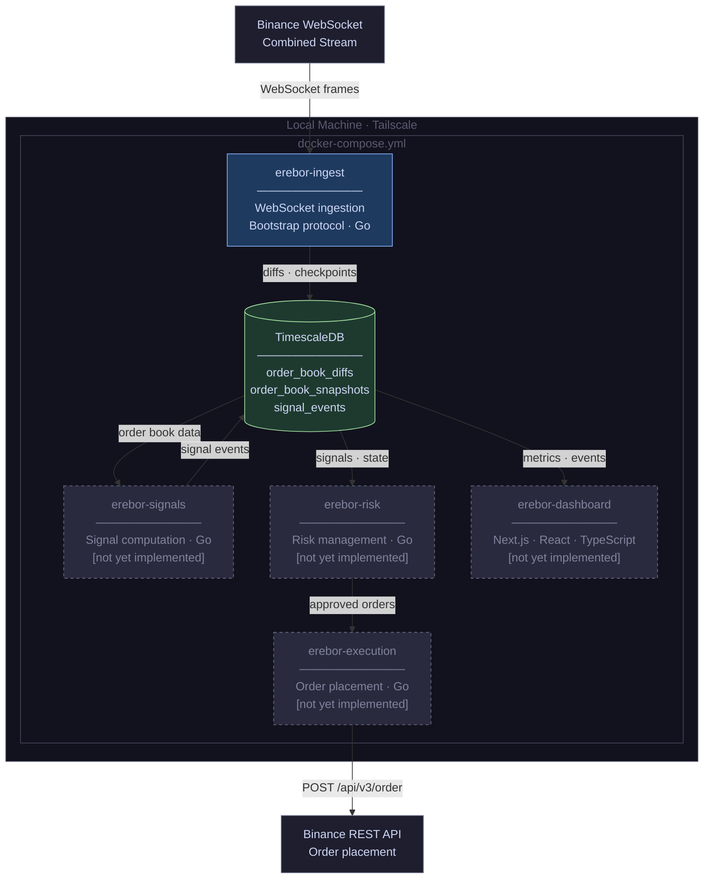

# ADR-002: Infrastructure and Deployment Platform

**Status:** Draft
**Date:** 2026-05
**Component:** Platform
**Author:** Erebor Architecture Session

---

## Context

Erebor is a multi-service system being built incrementally. The services, in rough dependency order:

| Module | Runtime | Responsibility |
|---|---|---|
| **erebor-ingest** | Go | Continuous Binance L2 order book ingestion into TimescaleDB |
| **erebor-signals** | Go | Consumes order book data, computes market signals and events |
| **erebor-risk** | Go | Risk management — enforces position and exposure limits before execution |
| **erebor-execution** | Go | Order placement on Binance, gated by risk |
| **erebor-dashboard** | Next.js · React · TypeScript | Web application — ingestion health, signal visibility, position monitoring |
| **TimescaleDB** | — | Time-series store for order book diffs, checkpoints, signals, and events |

Two goals shape these decisions: getting the system working, and learning Kubernetes. The deployment strategy is structured to serve both without the second blocking the first.

---

## Decision 1: Deployment Target — Local Machine

### Options Considered

**Cloud (AWS EC2).** Pay-per-use compute with managed networking. Monthly cost constrains iteration — every restart, schema wipe, or experiment has a background cost. Kubernetes on AWS (EKS) costs $73/month for the control plane alone before any nodes run.

**Local machine (mini PC, ~$200–250 one-time).** No recurring compute cost. Full control. k3s runs comfortably on 16 GB alongside all Erebor services. Remote access via Tailscale (free tier). Year-one budget preserved for cloud experiments or a future migration.

### Decision

**Local machine.**

### Rationale

Cloud compute imposes a background cost on every iteration during prototyping. A local machine eliminates that pressure and provides more RAM for less money. The one-time hardware cost leaves meaningful budget headroom for cloud experimentation once the system is stable.

The local setup is not a dead end. When Kubernetes is introduced (see Decision 3), the manifests developed locally transfer directly to EKS or a cloud-hosted k3s node. Existing CDK and IAM experience make that migration straightforward when the time comes.

Remote access via Tailscale requires no port forwarding, no VPN server, and no cloud infrastructure.

---

## Decision 2: Container Orchestration — Docker Compose

### Options Considered

**Docker Compose.** Declarative multi-container configuration. Single command to bring the full stack up. Scales naturally to additional services — each new module is an entry in `docker-compose.yml`. No learning curve overhead during active feature development.

**k3s (single-node Kubernetes).** Real Kubernetes API and tooling. StatefulSets, PersistentVolumeClaims, Ingress, Helm. Meaningful operational and learning investment before the first service runs.

### Decision

**Docker Compose.** k3s is the explicit next deployment target once the system is working end-to-end (see Deferred Decisions).

### Rationale

Docker Compose keeps iteration fast while the core system is being built. The `docker-compose.yml` expands naturally as new modules are introduced — adding `erebor-signals`, `erebor-risk`, and `erebor-execution` is additive, not structural change.

k3s is deferred, not abandoned. When the system reaches a stable baseline, the migration from Compose to k3s is a contained exercise with a working system as the reference point. The `docker-compose.yml` serves as the specification for the equivalent Kubernetes manifests; it should be kept accurate as services are added.

---

## Decision 3: Dashboard and API — Next.js, Vercel-optional

### Options Considered

**Next.js on Vercel (free tier).** Zero infrastructure management. Built-in preview deployments. Free tier covers personal-scale traffic. No lock-in — the same codebase runs self-hosted.

**Next.js in Docker (self-hosted).** `output: 'standalone'` in `next.config.js` produces a self-contained Node.js server with a minimal footprint. Runs as a service in the Compose stack alongside ingest and TimescaleDB. No Vercel dependency. Standard for teams or projects that cannot adopt Vercel.

**Angular.** Not considered — the dashboard is React and TypeScript.

### Decision

**Next.js (React, TypeScript) with Docker as the canonical deployment target. Vercel is a supported convenience for local development and personal use.**

### Rationale

Next.js has no hard dependency on Vercel. The standalone build output runs in a Docker container identically to any other Node.js service. This matters because most production projects cannot adopt Vercel as a dependency — the self-hosted path must be first-class.

The `docker-compose.yml` includes `erebor-dashboard` as a service. Vercel deployment remains available for personal use where convenience outweighs the desire to keep everything local — but it is not the canonical path.

**Database access:** API routes connect to TimescaleDB via the service name within the Compose network (`timescaledb:5432`). When deployed to cloud, the DSN is injected via environment variable.

---

## Service Topology

Docker Compose is the current runtime. The topology below reflects all planned modules — unimplemented services are listed to make their place in the stack explicit.

---

## Security Posture

- All credentials (TimescaleDB DSN, Binance API key/secret) are sourced from environment variables. Never in source code, logs, or committed configuration files.
- The Binance API key used by `erebor-execution` must be scoped to order placement only — no withdrawal permissions.
- `erebor-execution` is the only service that holds Binance trading credentials. Signal and risk services do not have exchange API access.
- When migrated to a cloud host, PostgreSQL inbound access is restricted by security group to known source IPs only. No unrestricted port 5432.

---

## Deferred Decisions

| Concern | Deferral Rationale |
|---|---|
| Inter-service messaging (NATS, Redis Streams) | Services currently communicate via TimescaleDB as shared store; a message broker becomes relevant when signals need to trigger execution with sub-second latency |
| k3s migration | Deferred until all services are stable end-to-end; manifests will be derived from the Compose file |
| Cloud migration (AWS) | Deferred until local setup is stable; existing CDK/IAM experience makes this a contained exercise |
| EKS | Control plane costs $73/month; only warranted after k3s experience and budget allows |
| RDS for TimescaleDB | Not justified until cloud migration; local persistence via named Docker volume with periodic S3 backups |
| Dashboard authentication | Dashboard is private by default (Tailscale network or basic auth); formal auth deferred |
| Language/runtime for signals, risk, execution | Decided — Go across all backend modules |

---

## Consequences

- The `docker-compose.yml` is the authoritative definition of the full service topology. It must be kept current as modules are added. It is also the source specification for future k3s manifests.
- New modules that read from TimescaleDB connect via the Compose service name (`timescaledb:5432`) and consume the DSN from environment variables.
- The execution path (signals → risk → execution) is not yet designed. An inter-service messaging ADR will be needed before those modules are implemented.
- The ingest machine is the single point of failure for all services. This is accepted at this stage. The bootstrap protocol in ADR-001 handles ingest recovery automatically on restart.
