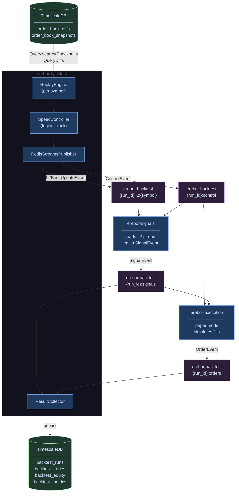

# Backtest & Replay Engine — Specification

**Status:** Draft  
**Date:** 2026-05  
**Component:** `erebor-backtest`  
**Depends on:** ADR-001 (hybrid L2 persistence), ADR-002 (infrastructure)

---

## 1. Decisions

| Concern | Decision | Rationale |
|---|---|---|
| Event bus | Redis Streams | Persistent, ordered, consumer-group-based. Decouples signal code from its data source. Cheap to operate on existing infra. |
| Clock strategy | Event timestamp only | Signals read time exclusively from `event.EventTime`. `time.Now()` is structurally forbidden in signal and execution logic. Replay fidelity is guaranteed by construction — no discipline required. |
| Backtest binary | Dedicated `erebor-backtest` | Separate `main` package that imports the same signal/book/execution libraries. Cleaner operational boundary; live and backtest processes never share process state. |
| Stream namespace | `erebor:backtest:{run_id}:*` | Each run is fully isolated. Live streams use `erebor:live:*`. No cross-contamination is possible. |

---

## 2. Overview

`erebor-backtest` orchestrates a complete backtest run:

1. Creates a `run_id` (UUID v7) and persists run metadata.
2. Reads historical L2 data from TimescaleDB using the existing `Repository.QueryNearestCheckpoint` / `Repository.QueryDiffs` contract established in ADR-001.
3. Reconstructs the order book tick-by-tick using the same `book.OrderBook` code used live.
4. Publishes `L2BookUpdateEvent` structs to Redis Streams under a run-namespaced key.
5. `erebor-signals` reads from the backtest stream (configured via `STREAM_NAMESPACE` env var) and emits signals — identical to live operation.
6. `erebor-execution` runs in paper mode, simulating fills against the replayed L2.
7. `erebor-backtest` collects results and computes performance metrics.

The key invariant: **signal logic is identical in live and backtest**. The only difference is which Redis stream it reads from.



---

## 3. Redis Streams Namespace

All stream keys are prefixed to prevent namespace collisions.

| Stream | Key | Publisher | Consumer(s) |
|---|---|---|---|
| L2 book updates | `erebor:backtest:{run_id}:l2:{symbol}` | `erebor-backtest` | `erebor-signals` |
| Signals | `erebor:backtest:{run_id}:signals` | `erebor-signals` | `erebor-execution`, `erebor-backtest` (collector) |
| Orders / fills | `erebor:backtest:{run_id}:orders` | `erebor-execution` | `erebor-backtest` (collector) |
| Control | `erebor:backtest:{run_id}:control` | `erebor-backtest` | All consumers |

**Live streams** (not touched by backtest): `erebor:live:l2:{symbol}`, `erebor:live:signals`.

Stream TTL: all backtest streams are set with `EXPIRE` to 24 hours after run completion. Raw results are persisted in TimescaleDB before expiry.

---

## 4. Component Model

```
erebor-backtest binary
├── BacktestRunner        — Entry point. Creates run_id, coordinates lifecycle.
├── ReplayEngine          — Per-symbol. Seeks checkpoint, replays diffs, emits events.
├── SpeedController       — Global logical clock. Paces event emission across symbols.
├── RedisStreamsPublisher  — Publishes L2BookUpdateEvent to Redis.
├── ResultCollector       — Subscribes to signals/orders streams; persists results.
└── MetricsComputer       — Computes Sharpe, drawdown, etc. from persisted trades.

shared libraries (also used by live binaries)
├── book.OrderBook            — In-memory order book. Apply diffs, produce snapshots.
├── domain.L2BookUpdateEvent  — The canonical event type on the bus.
├── repository.Repository     — TimescaleDB read/write interface.
└── redis.StreamClient        — Thin Redis Streams wrapper (XADD, XREAD, XREADGROUP).
```

**Critical boundary:** `ReplayEngine` uses `book.OrderBook` from the live codebase unchanged. No "backtest mode" branches inside `OrderBook`.

---

## 5. Domain Types

These types form the event contract between all services on the bus.

```go
// L2BookUpdateEvent is the canonical event published to Redis Streams.
// Consumers MUST read EventTime from this struct — never call time.Now().
type L2BookUpdateEvent struct {
    RunID        string    // empty string = live event
    Symbol       string
    EventTime    time.Time // logical clock value; source of truth for all consumers
    LastUpdateID int64
    Bids         []PriceLevel
    Asks         []PriceLevel
}

// SignalEvent is published by erebor-signals to the signals stream.
type SignalEvent struct {
    RunID     string
    Symbol    string
    EventTime time.Time // propagated from the L2BookUpdateEvent that triggered it
    Name      string    // e.g. "book_imbalance", "spread_bps"
    Version   string
    Value     decimal.Decimal
    Params    map[string]string
}

// OrderEvent is published by erebor-execution to the orders stream.
type OrderEvent struct {
    RunID     string
    Symbol    string
    EventTime time.Time
    OrderID   string
    Side      Side        // Buy | Sell
    Type      OrderType   // Limit | Market
    Price     decimal.Decimal
    Quantity  decimal.Decimal
    Status    OrderStatus // Pending | Open | PartiallyFilled | Filled | Cancelled
    FillPrice decimal.Decimal
    FillQty   decimal.Decimal
    Fee       decimal.Decimal
}

// ControlEvent is published by erebor-backtest to the control stream.
type ControlEvent struct {
    RunID   string
    Type    ControlEventType // ReplayStart | ReplayComplete | DataGap | Cancelled
    Payload map[string]string
}
```

---

## 6. Replay Engine

### 6.1 Seek and Replay Protocol

For each symbol, `ReplayEngine` follows the query contract defined in ADR-001:

```
1. checkpoint = Repository.QueryNearestCheckpoint(symbol, from_time)
2. book.Reset(); book.LoadSnapshot(checkpoint)
3. diffs = Repository.QueryDiffs(symbol, checkpoint.SnapshotTime, to_time)
4. for each diff in diffs:
     book.Apply(diff)
     SpeedController.WaitUntil(diff.EventTime)
     publisher.Publish(L2BookUpdateEvent{
         Symbol:    symbol,
         EventTime: diff.EventTime,   // ← logical clock; never time.Now()
         ...book.TopOfBook(),
     })
```

### 6.2 Multi-Symbol Coordination

When replaying multiple symbols, each runs in its own goroutine. The `SpeedController` holds a global logical clock:

- **AFAP mode**: No waiting. Each goroutine publishes as fast as TimescaleDB serves data.
- **N× mode**: After publishing event at `t`, goroutine sleeps `Δt / N` where `Δt` is the wall-clock delta to the next event.
- **Wall-clock mode**: N = 1.

The clock does not need to be synchronized across symbols in AFAP mode — each goroutine advances independently. In N× and wall-clock modes, the speed controller applies per-goroutine rate limiting relative to the event's `EventTime` vs. the run's `startedAt` wall time.

### 6.3 Data Gaps

If `QueryDiffs` returns a sequence gap (detected by `first_update_id` discontinuity), `ReplayEngine`:
1. Emits a `ControlEvent{Type: DataGap}` with the gap bounds.
2. Seeks a new checkpoint at the gap boundary and continues.
3. Records the gap in `backtest_data_gaps` table.

A data gap does not terminate the run.

---

## 7. Fill Model (Paper Execution)

`erebor-execution` in paper mode simulates order fills against the replayed L2 stream.

### 7.1 Fill Rules

| Order type | Fill condition |
|---|---|
| Limit buy | Filled when `best_ask ≤ limit_price` in the replayed book |
| Limit sell | Filled when `best_bid ≥ limit_price` in the replayed book |
| Market buy | Filled immediately at `best_ask + slippage` |
| Market sell | Filled immediately at `best_bid - slippage` |

Partial fills are not modeled in v1 — all fills are assumed complete at the qualifying tick.

### 7.2 Slippage and Fee Model

Configurable per run via `strategy_config` JSONB:

| Parameter | Default | Description |
|---|---|---|
| `maker_fee_bps` | `10` | Basis points charged on limit fills |
| `taker_fee_bps` | `10` | Basis points charged on market fills |
| `slippage_bps` | `0` | Fixed additional slippage applied to market orders |

Fee is computed as: `fill_qty × fill_price × fee_bps / 10000`.

---

## 8. Result Persistence

New migration: `002_backtest_schema.sql`

```sql
CREATE TABLE backtest_runs (
    run_id          UUID        PRIMARY KEY,
    symbols         TEXT[]      NOT NULL,
    from_time       TIMESTAMPTZ NOT NULL,
    to_time         TIMESTAMPTZ NOT NULL,
    speed_mode      TEXT        NOT NULL,  -- 'AFAP' | 'NX' | 'WALL_CLOCK'
    speed_factor    NUMERIC,               -- N for NX mode; null otherwise
    strategy_config JSONB       NOT NULL,
    status          TEXT        NOT NULL,  -- 'PENDING' | 'RUNNING' | 'COMPLETED' | 'FAILED' | 'CANCELLED'
    started_at      TIMESTAMPTZ,
    completed_at    TIMESTAMPTZ,
    error           TEXT
);

CREATE TABLE backtest_trades (
    run_id      UUID        NOT NULL REFERENCES backtest_runs(run_id),
    trade_id    UUID        NOT NULL,
    symbol      TEXT        NOT NULL,
    event_time  TIMESTAMPTZ NOT NULL,
    side        TEXT        NOT NULL,  -- 'buy' | 'sell'
    fill_price  NUMERIC     NOT NULL,
    fill_qty    NUMERIC     NOT NULL,
    fee         NUMERIC     NOT NULL,
    signal_name TEXT,
    PRIMARY KEY (run_id, trade_id)
);

CREATE TABLE backtest_equity (
    run_id     UUID        NOT NULL REFERENCES backtest_runs(run_id),
    event_time TIMESTAMPTZ NOT NULL,
    equity     NUMERIC     NOT NULL
);

SELECT create_hypertable('backtest_equity', 'event_time', if_not_exists => TRUE);

CREATE TABLE backtest_data_gaps (
    run_id    UUID        NOT NULL REFERENCES backtest_runs(run_id),
    symbol    TEXT        NOT NULL,
    gap_from  TIMESTAMPTZ NOT NULL,
    gap_to    TIMESTAMPTZ NOT NULL
);

CREATE TABLE backtest_metrics (
    run_id            UUID    PRIMARY KEY REFERENCES backtest_runs(run_id),
    total_return_pct  NUMERIC,
    annualized_return NUMERIC,
    sharpe_ratio      NUMERIC,
    max_drawdown_pct  NUMERIC,
    hit_rate_pct      NUMERIC,
    avg_win           NUMERIC,
    avg_loss          NUMERIC,
    trade_count       INT,
    computed_at       TIMESTAMPTZ NOT NULL DEFAULT now()
);
```

---

## 9. Run Lifecycle

```
PENDING → RUNNING → COMPLETED
                 → FAILED
                 → CANCELLED
```

`BacktestRunner` transitions `status` in `backtest_runs` at each state change.

On `COMPLETED`: `MetricsComputer` reads `backtest_trades` and `backtest_equity`, computes metrics, writes to `backtest_metrics`.

On `FAILED`: `error` column is populated with the terminal error message.

`CANCELLED` is triggered by a `SIGTERM` to `erebor-backtest` or an explicit API call (future scope).

---

## 10. Control Protocol

All consumers subscribe to `erebor:backtest:{run_id}:control` before starting work.

| Event type | Emitted by | Meaning |
|---|---|---|
| `REPLAY_START` | `erebor-backtest` | Run is beginning; consumers should initialize |
| `REPLAY_COMPLETE` | `erebor-backtest` | All events published; consumers should drain and exit |
| `DATA_GAP` | `erebor-backtest` | Gap in source data; run continues |
| `CANCELLED` | `erebor-backtest` | Run aborted; consumers should stop immediately |

When a consumer receives `REPLAY_COMPLETE` or `CANCELLED`, it drains its pending work, persists any buffered results, and exits cleanly.

---

## 11. Configuration

`erebor-backtest` is invoked as:

```
erebor-backtest \
  --run-id <uuid>           \  # optional; generated if absent
  --symbols BTCUSDT,ETHUSDT \
  --from 2026-01-01T00:00:00Z \
  --to   2026-01-31T23:59:59Z \
  --speed AFAP              \  # AFAP | 10X | WALL_CLOCK
  --strategy-config '{"maker_fee_bps": 10, "taker_fee_bps": 10}'
```

Environment variables (same pattern as `erebor-ingest`):

| Var | Required | Description |
|---|---|---|
| `TIMESCALE_DSN` | Yes | TimescaleDB connection string |
| `REDIS_ADDR` | Yes | Redis address (e.g. `localhost:6379`) |
| `REDIS_PASSWORD` | No | Redis auth |

---

## 12. Deferred

| Concern | Rationale |
|---|---|
| Walk-forward validation | Requires a runner loop over this engine; deferred to strategy layer |
| Partial fills | Adds complexity to fill model; not needed for v1 |
| Multi-run parallelism | Each run is independent; orchestration deferred to a future scheduler |
| Dashboard integration | Backtest browser UI deferred until result schema is stable |
| `erebor-signals` / `erebor-execution` binaries | This spec defines the contract; those binaries are separate deliverables |
