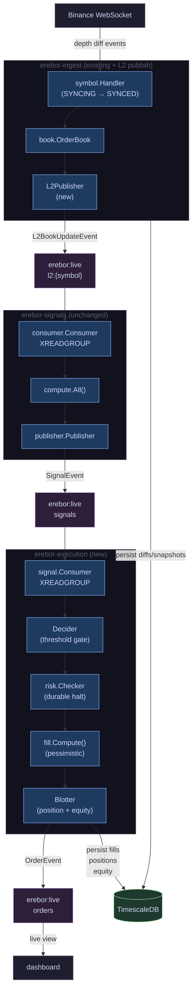

# Live Paper Trading — Specification

**Status:** Draft  
**Date:** 2026-05  
**Component:** `erebor-execution` (new binary) + ingest L2 publishing  
**Depends on:** backtest-replay spec, erebor-signals spec, erebor-risk spec

---

## 1. Decisions

| Concern | Decision | Rationale |
|---|---|---|
| Mode identity | `EXECUTION_MODE=PAPER` env var on `erebor-execution` | Same binary will eventually support live order placement; mode flag avoids a separate executable and keeps the diff to backtest minimal |
| Signal coupling | Execution reads from `erebor:live:signals` stream, not L2 directly | Backtest executor computes imbalance inline from L2 (deferred coupling noted in signals spec). Paper trading completes that decoupling: execution becomes signal-agnostic and easier to evolve |
| Fill model | Pessimistic market fill identical to backtest executor | Consistency between backtest and paper results is the point. If a strategy passes backtest with pessimistic fills it has a fair chance live. Diverging the fill model breaks that comparison |
| Time source | `event.EventTime` from the L2 event that produced the signal | Same invariant as backtest and signals. `time.Now()` is structurally forbidden in fill and decision logic |
| Fill shared package | Extract fill/fee math to `engine/execution/fill.go` | Backtest executor and paper executor must use identical arithmetic. A shared package enforces this; copy-paste would drift |
| Position persistence | Write to TimescaleDB after every confirmed fill | In-memory state (as in backtest) does not survive process restarts. Paper trading sessions can run for days; durable positions are non-negotiable |
| Risk halt durability | Halt flag written to a Redis hash key | Fast to check (no DB roundtrip on every CanTrade call), survives process restarts, and is cheap on the existing Redis instance |
| L2 Redis publishing | New publisher wired into `erebor-ingest` per-symbol handler | The ingest binary already reconstructs the live order book tick-by-tick; it is the only correct place to publish live L2. Minimum code change, no new process |
| Stream TTL | Live streams have no TTL | Backtest streams expire after 24 hours. Live streams are consumed continuously and must not be silently dropped. Explicit cleanup is done at session close |
| Session concept | A `paper_session` row tracks each continuous paper trading run | Analogous to `backtest_runs`. Provides a clear unit for P&L attribution and restart recovery |

---

## 2. Overview

Paper trading is a live, continuous execution loop that reads real market data from the existing ingest pipeline, computes fills against the live order book using a pessimistic simulation model, and tracks positions and P&L in TimescaleDB — without placing any real orders on Binance.

Three changes to existing services plus one new binary are required:

1. **`erebor-ingest`** gains an L2 Redis publisher that mirrors every book update to `erebor:live:l2:{symbol}` as it arrives from the WebSocket.
2. **`erebor-signals`** already works in live mode (`STREAM_NAMESPACE=erebor:live`); no changes needed.
3. **`erebor-risk`** gains a Redis-backed halt persistence so the halt state survives restarts.
4. **`erebor-execution`** is a new binary. In `PAPER` mode it reads signals, simulates fills, persists trades, and tracks equity.



---

## 3. Redis Stream Namespace

| Stream | Key | Publisher | Consumer(s) |
|---|---|---|---|
| Live L2 updates | `erebor:live:l2:{symbol}` | `erebor-ingest` | `erebor-signals` |
| Live signals | `erebor:live:signals` | `erebor-signals` | `erebor-execution` |
| Live orders / fills | `erebor:live:orders` | `erebor-execution` | dashboard, collector |
| Live risk events | `erebor:live:risk` | `erebor-execution` (via risk.Checker) | dashboard, observability |

**Backtest streams** (`erebor:backtest:{run_id}:*`) are not touched.

Live streams have no TTL. Stream trimming: `erebor:live:l2:{symbol}` and `erebor:live:signals` are trimmed with `MAXLEN ~ 50000` (approximate) on each `XADD` to bound memory. `erebor:live:orders` and `erebor:live:risk` are append-only and not trimmed (low volume, durable record).

**Halt state key:** `erebor:live:halt` — Redis hash, field per session ID. Value: `"1"` when halted.

---

## 4. Component Model

```
erebor-execution binary (new)
├── session.Manager        — Creates/resumes paper_session row; owns lifecycle.
├── signal.Consumer        — XREADGROUP loop on erebor:live:signals; one goroutine.
├── Decider                — Stateless: maps (SignalEvent, positionState) → (Side, bool).
├── fill.Compute()         — Shared with backtest. Pessimistic fill price + fee arithmetic.
├── risk.Checker           — Imported from engine/risk. CanTrade gate + RecordFill update.
│   └── redis.HaltStore    — New: persists halt flag to erebor:live:halt hash on trigger.
├── Blotter                — Per-symbol position tracking + equity curve. Writes to DB.
└── order.Publisher        — XADD to erebor:live:orders.

engine/execution/fill.go (new shared package)
├── ComputeFillPrice(side, bids, asks, slippageBps) decimal.Decimal
└── ComputeFee(qty, price, feeBps) decimal.Decimal

erebor-ingest changes
└── symbol/handler.go      — Wire L2Publisher.Publish() after book.Apply(diff).
    └── publisher/l2.go    — Already exists in engine/backtest/publisher/l2.go; move to engine/publisher/.

engine/risk changes
└── checker.go             — Inject HaltStore interface; call on halt transition only.
```

**Critical boundary:** `fill.Compute()` is the single source of truth for fill arithmetic. The backtest executor is refactored to import it. No copy-paste between backtest and paper.

---

## 5. Domain Types

Reuse existing types unchanged. One new type is added.

```go
// Existing types reused without modification:
//   domain.L2BookUpdateEvent  (from engine/signals/domain)
//   domain.SignalEvent        (from engine/signals/domain)
//   domain.OrderEvent         (from engine/backtest/domain)
//   risk.Config, risk.Event   (from engine/risk)

// PaperSession tracks a continuous paper trading run.
type PaperSession struct {
    SessionID      string          // UUID v7
    Status         SessionStatus   // RUNNING | STOPPED | HALTED
    Symbols        []string
    StrategyConfig string          // JSON, same schema as backtest strategy_config
    StartedAt      time.Time
    StoppedAt      *time.Time
    InitialEquity  decimal.Decimal
    Error          string
}

type SessionStatus string

const (
    SessionRunning SessionStatus = "RUNNING"
    SessionStopped SessionStatus = "STOPPED"
    SessionHalted  SessionStatus = "HALTED"
)
```

`OrderEvent.RunID` is set to the `session_id` of the active paper session. This allows the same dashboard and collector code used by backtest to consume live orders without modification.

---

## 6. erebor-ingest Changes

### 6.1 L2 Publisher Wiring

`engine/symbol/handler.go` applies each diff to the order book and persists it to TimescaleDB. A new call is added immediately after `book.Apply(diff)`:

```go
// in handler.go after book.Apply(diff):
if err := h.l2Publisher.Publish(ctx, domain.L2BookUpdateEvent{
    RunID:        "",   // empty = live
    Symbol:       h.symbol,
    EventTime:    diff.EventTime,
    LastUpdateID: diff.FinalUpdateID,
    Bids:         book.TopBids(h.cfg.DepthLimit),
    Asks:         book.TopAsks(h.cfg.DepthLimit),
}); err != nil {
    h.logger.Warn("l2 publish failed", zap.String("symbol", h.symbol), zap.Error(err))
    // non-fatal: ingest continues; signals will lag until Redis recovers
}
```

Publish errors are logged and swallowed. TimescaleDB persistence is unaffected.

### 6.2 Shared L2 Publisher Package

`engine/backtest/publisher/l2.go` is moved to `engine/publisher/l2.go` and imported by both `erebor-ingest` and `erebor-backtest`. The backtest publisher is updated to import the shared package. The interface and wire format are unchanged.

### 6.3 Stream Trimming

The shared publisher passes `MAXLEN ~ 50000` on every `XADD` to `erebor:live:l2:{symbol}`. This caps each symbol's stream at approximately 50 000 L2 events (~10–30 minutes of BTCUSDT depth at typical diff rates) and prevents unbounded Redis memory growth.

---

## 7. Fill Model (Pessimistic Paper Execution)

Paper fills use the same pessimistic model as the backtest executor, extracted to `engine/execution/fill.go`.

### 7.1 Fill Price

```
BUY  fill price = best_ask × (1 + slippage_bps / 10000)
SELL fill price = best_bid × (1 − slippage_bps / 10000)
```

`best_ask` and `best_bid` are taken from the `L2BookUpdateEvent` whose signal triggered the trade. The fill is simulated as a market taker order. We always cross the spread and pay slippage on top.

### 7.2 Fee

```
fee = fill_qty × fill_price × taker_fee_bps / 10000
```

Fees are always charged at the taker rate. There are no maker fills in paper mode.

### 7.3 Why This Is Pessimistic

| Assumption | Effect |
|---|---|
| Always cross the spread (taker) | Pays ask, receives bid — never mid |
| Slippage applied on top of spread | Additional cost beyond the quoted price |
| Taker fee always | No rebate for posting liquidity |
| Fill on same tick as signal | No latency model; in practice, live orders take milliseconds — the fill may be at a worse price by then |

A strategy that is profitable under this model has a reasonable floor for live performance. The single-tick latency assumption is the main optimism remaining; see §14.

### 7.4 Shared Package Interface

```go
// engine/execution/fill.go

// ComputeFillPrice returns the simulated fill price for a market order.
// bids must be sorted descending (best first); asks ascending (best first).
func ComputeFillPrice(side domain.Side, bids, asks []domain.PriceLevel, slippageBps int) (decimal.Decimal, error)

// ComputeFee returns the fee charged for a fill.
func ComputeFee(fillQty, fillPrice decimal.Decimal, feeBps int) decimal.Decimal
```

The backtest executor is refactored to call these functions. No behaviour change, only code consolidation.

---

## 8. erebor-execution Binary

### 8.1 Signal Consumer

Reads from `erebor:live:signals` using `XREADGROUP` with consumer group `erebor-execution`. One goroutine; no per-symbol goroutines (unlike the backtest executor which fans out over L2 per symbol).

Signal events carry `Symbol` and `Name` fields. The consumer routes each signal to the per-symbol `positionState` map.

### 8.2 Decider

The `Decider` is a stateless function. Given a `SignalEvent` and the current `positionState`, it returns `(Side, shouldTrade bool)`.

```
signal name = "book_imbalance":
    value > buy_threshold  AND position is flat or short  →  BUY
    value < -sell_threshold AND position is flat or long  →  SELL
    otherwise                                             →  no trade

all other signal names: no trade (ignored for now)
```

Thresholds come from `StrategyConfig` (same JSON schema as backtest).

### 8.3 Execution Flow (per signal event)

```
1. Consume SignalEvent from erebor:live:signals
2. Decider(signal, positionState[symbol]) → (side, shouldTrade)
3. if !shouldTrade: XACK and continue
4. risk.CanTrade(symbol, side, qty, signal.EventTime) → err?
5. if err: log, publish RiskEvent, XACK and continue
6. Look up latest L2 snapshot for symbol from in-memory cache
7. fill.ComputeFillPrice(side, bids, asks, slippageBps)
8. fill.ComputeFee(qty, fillPrice, takerFeeBps)
9. Blotter.RecordFill(symbol, side, qty, fillPrice, fee, signal.EventTime)
   └─ Persist paper_trade row to TimescaleDB
   └─ Update paper_position row (upsert)
   └─ Append paper_equity row
   └─ Update positionState[symbol]
10. risk.RecordFill(symbol, side, qty, fillPrice, fee)
11. order.Publisher.Publish(OrderEvent)
12. XACK
```

### 8.4 L2 Snapshot Cache

`erebor-execution` maintains a per-symbol in-memory cache of the latest `L2BookUpdateEvent`. It subscribes to `erebor:live:l2:{symbol}` using `XREAD` (not a consumer group — it only needs the latest state, not delivery guarantees) and updates the cache on every event.

If no cached L2 exists for a symbol when a fill is attempted (race at startup), the fill is skipped and logged. This window is typically sub-second.

### 8.5 Session Startup and Recovery

On startup, `session.Manager` checks for an existing `RUNNING` session in `paper_sessions`:

- **No running session:** Create a new row, `status=RUNNING`. Load initial equity from config.
- **Running session found:** Resume it. Load positions from `paper_positions`. Load halt state from `erebor:live:halt`. Replay last equity point from `paper_equity`.

This ensures that a restart does not reset the position state or lose P&L context.

### 8.6 Health

`GET /healthz` returns `200` when the signal consumer read loop is active and the session is `RUNNING`. Returns `503` when halted or when the consumer has not received a message within a configurable stale threshold (default: 30 s).

---

## 9. Position Tracking and Blotter

`Blotter` manages position and equity state. All writes are synchronous (in the fill hot path) to ensure that a crash after `XACK` and before persistence is caught on recovery via the signal's sequence ID.

### 9.1 Position Model

Net position per symbol: `positions[symbol] = Σ signed_qty` where buy fills are positive, sell fills are negative.

```
open long  = positions[symbol] > 0
open short = positions[symbol] < 0
flat       = positions[symbol] == 0
```

### 9.2 Equity Model

```
equity = initial_equity + Σ realised_pnl − Σ fees
```

Unrealised P&L is not tracked in v1. Equity is updated only on fills.

Realised P&L on a closing fill is:
```
close BUY  (covers short): (entry_price − fill_price) × fill_qty − fee
close SELL (covers long):  (fill_price − entry_price) × fill_qty − fee
```

`entry_price` is the volume-weighted average fill price of the open position. The blotter maintains a running VWAP per symbol.

### 9.3 Persistence Contract

Every call to `Blotter.RecordFill()` performs three TimescaleDB writes in a single transaction:

1. `INSERT INTO paper_trades ...`
2. `INSERT INTO paper_positions ... ON CONFLICT (session_id, symbol) DO UPDATE SET ...`
3. `INSERT INTO paper_equity ...`

The transaction is synchronous. If it fails, the error is logged, the order event is not published, and `XACK` is not called. The signal will be redelivered on the next `XREADGROUP` call and the fill retried. Fill idempotency is guaranteed by a unique constraint on `(session_id, signal_stream_id)` in `paper_trades`.

---

## 10. Risk Management (Live)

`risk.Checker` is reused unchanged. The only new requirement is durable halt state.

### 10.1 Halt Persistence

A new `HaltStore` interface is injected into `risk.Checker`:

```go
type HaltStore interface {
    // SetHalted persists the halt flag for the given session.
    SetHalted(ctx context.Context, sessionID string) error
    // IsHalted returns true if a halt was previously persisted for this session.
    IsHalted(ctx context.Context, sessionID string) (bool, error)
}
```

Implementation: `RedisHaltStore` writes to Redis hash `erebor:live:halt`, field = `session_id`, value = `"1"`.

On `Checker.CanTrade()`: if `c.halted` is false, call `HaltStore.IsHalted()` once (cached for the session lifetime after the first check). If a halt is found in Redis, set `c.halted = true` immediately.

On halt trigger (drawdown or run-loss rule fires): call `HaltStore.SetHalted()` before returning the error. Session status is updated to `HALTED` in `paper_sessions`.

### 10.2 Risk Config for Paper Trading

Same `strategy_config` JSON fields as backtest:

```json
{
  "trade_qty": "0.001",
  "buy_threshold": "0.2",
  "sell_threshold": "0.2",
  "taker_fee_bps": 10,
  "slippage_bps": 5,
  "initial_capital": "10000",
  "max_position_qty": { "BTCUSDT": "0.005" },
  "max_drawdown_pct": "5",
  "run_loss_limit_pct": "10"
}
```

`slippage_bps` should be set higher for paper trading than backtest to account for the single-tick latency assumption (e.g., 5 bps live vs. 0 bps backtest).

---

## 11. Configuration

```yaml
# erebor-execution config.yaml
execution_mode: PAPER          # PAPER | LIVE (LIVE not implemented yet)
symbols:
  - BTCUSDT
strategy_config: |
  {
    "trade_qty": "0.001",
    "buy_threshold": "0.2",
    "sell_threshold": "0.2",
    "taker_fee_bps": 10,
    "slippage_bps": 5,
    "initial_capital": "10000",
    "max_position_qty": { "BTCUSDT": "0.005" },
    "max_drawdown_pct": "5",
    "run_loss_limit_pct": "10"
  }
stream_namespace: erebor:live  # not overridable in paper mode; reserved for future test modes
redis:
  addr: localhost:6379
  password: ""
log:
  level: info
  file_level: debug
  file_path: /var/log/erebor-execution.log
health:
  addr: ":8082"
l2_stale_threshold: 30s        # max age of cached L2 before fill is skipped
```

**Environment variable overrides:**

| Var | Config key |
|---|---|
| `REDIS_ADDR` | `redis.addr` |
| `REDIS_PASSWORD` | `redis.password` |
| `TIMESCALE_DSN` | database DSN |
| `EXECUTION_MODE` | `execution_mode` |

---

## 12. Database Schema

New migration: `003_paper_trading_schema.sql`

```sql
CREATE TABLE paper_sessions (
    session_id      UUID        PRIMARY KEY,
    status          TEXT        NOT NULL,        -- 'RUNNING' | 'STOPPED' | 'HALTED'
    symbols         TEXT[]      NOT NULL,
    strategy_config JSONB       NOT NULL,
    initial_equity  NUMERIC     NOT NULL,
    started_at      TIMESTAMPTZ NOT NULL DEFAULT now(),
    stopped_at      TIMESTAMPTZ,
    error           TEXT
);

CREATE TABLE paper_trades (
    session_id       UUID        NOT NULL REFERENCES paper_sessions(session_id),
    trade_id         UUID        NOT NULL,
    symbol           TEXT        NOT NULL,
    event_time       TIMESTAMPTZ NOT NULL,
    side             TEXT        NOT NULL,        -- 'buy' | 'sell'
    fill_price       NUMERIC     NOT NULL,
    fill_qty         NUMERIC     NOT NULL,
    fee              NUMERIC     NOT NULL,
    realised_pnl     NUMERIC     NOT NULL DEFAULT 0,
    signal_name      TEXT        NOT NULL,
    signal_stream_id TEXT        NOT NULL,        -- Redis stream message ID; idempotency key
    PRIMARY KEY (session_id, trade_id),
    UNIQUE (session_id, signal_stream_id)
);

-- paper_positions stores the latest known position per symbol per session.
-- Upserted on every fill; used for restart recovery.
CREATE TABLE paper_positions (
    session_id   UUID        NOT NULL REFERENCES paper_sessions(session_id),
    symbol       TEXT        NOT NULL,
    net_qty      NUMERIC     NOT NULL DEFAULT 0,
    avg_entry    NUMERIC     NOT NULL DEFAULT 0,   -- VWAP of open position
    updated_at   TIMESTAMPTZ NOT NULL,
    PRIMARY KEY (session_id, symbol)
);

CREATE TABLE paper_equity (
    session_id UUID        NOT NULL REFERENCES paper_sessions(session_id),
    event_time TIMESTAMPTZ NOT NULL,
    equity     NUMERIC     NOT NULL
);

SELECT create_hypertable('paper_equity', 'event_time', if_not_exists => TRUE);

-- Index for session recovery and dashboard queries.
CREATE INDEX ON paper_trades (session_id, event_time DESC);
CREATE INDEX ON paper_equity (session_id, event_time DESC);
```

---

## 13. Session Lifecycle

```
RUNNING → STOPPED    (graceful SIGTERM)
        → HALTED     (risk gate triggers)
```

On `SIGTERM`: `session.Manager` sets `status=STOPPED` and `stopped_at=now()` in `paper_sessions`, then waits for the signal consumer to drain its pending XACK queue (up to 5 s). No position squaring — open positions are left as-is and recovered on the next run.

On halt: `status=HALTED`. The process continues running but `CanTrade()` returns errors for all symbols. The operator must explicitly clear the halt (delete the key in `erebor:live:halt` or start a new session) to resume trading.

A halted session is not auto-resumed on restart. `session.Manager` detects `HALTED` status at startup and logs a warning; it does not create a new session unless the halt is cleared.

---

## 14. Operational Runbook

Bring up paper trading in order:

```bash
# 1. Start market data infrastructure (already running in prod)
docker compose up -d timescaledb redis

# 2. Start ingestion (add L2 Redis publishing)
erebor-ingest -config config/ingest.yaml

# 3. Start signals (unchanged, just set namespace)
STREAM_NAMESPACE=erebor:live erebor-signals -config config/signals.yaml

# 4. Start paper execution
erebor-execution -config config/execution.yaml
```

Verify:
```bash
# Check L2 is flowing to Redis
redis-cli XLEN erebor:live:l2:BTCUSDT        # should grow over time

# Check signals are computed
redis-cli XLEN erebor:live:signals           # should grow

# Check fills are happening
redis-cli XLEN erebor:live:orders            # increments on each trade

# Check equity
psql $TIMESCALE_DSN -c "SELECT * FROM paper_equity ORDER BY event_time DESC LIMIT 5"
```

---

## 15. Deferred

| Concern | Rationale |
|---|---|
| Live order placement (real Binance REST calls) | `EXECUTION_MODE=LIVE` code path reserved but not implemented. Paper mode must be validated first |
| One-tick fill delay model | Fills currently simulate on the same tick as the signal. A one-tick delay would more accurately model network latency. Adds complexity to the L2 cache and fill ordering; deferred to v2 |
| Partial fills | Paper mode fills are always complete. Modelling partial fills requires a simulated order book queue; deferred |
| Unrealised P&L and mark-to-market | Equity tracks realised P&L only. Mark-to-market requires continuous price ticks against open positions; adds complexity to the equity hypertable write rate |
| Multi-session management API | No HTTP API to start/stop/inspect sessions in v1. Operational control is via config file and process signals |
| Dashboard paper trading view | Dashboard spec extension needed to consume `erebor:live:orders` and display live equity curve and positions |
| Per-session strategy hot-reload | Changing thresholds or risk limits requires a process restart. Dynamic reload is a future orchestration concern |
| Walk-forward paper validation | Running paper and backtest on the same period simultaneously for comparison; depends on multi-session support |
